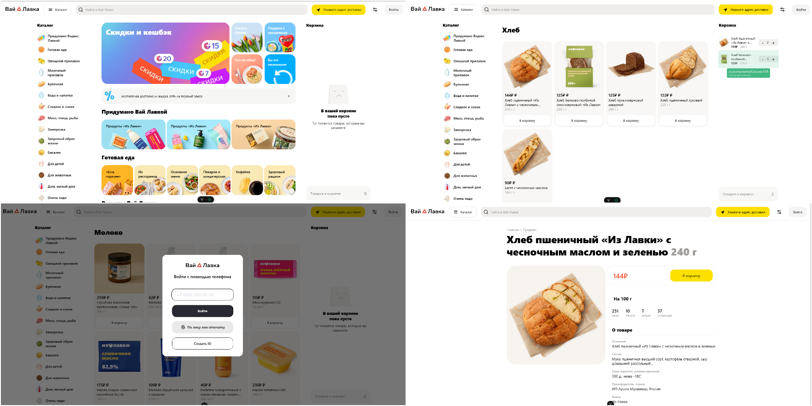

<div align="center">
  <br />
    <a href="https://github.com/magasov" target="_blank">
      
    </a>
  <br />
 
  <p>
    <code></code>
    <code></code>
    <code></code>
  </p>
  <h1 align="center">Yandex Lavka | Вай Лавка</h1>

   <div align="center">
     Это клонированная версия популярного сайта Yandex Lavka
    </div>
</div>

## Gallery

   

## Demo

[](https://www.youtube.com/embed/your-video-id "Click!")

## Стэк

<div style="display: flex; flex-direction: column; align-items: center;">
  <p>
    <strong>Vue.js</strong>  <br>
    <strong>Pinia</strong>  <br>
    <strong>Vue Router</strong>  <br>
    <strong>Sass/SCSS</strong>  <br>
    <strong>Vite</strong> 
  </p>
</div>

## Project Setup

```sh
npm install
```

### Compile and Hot-Reload for Development

```sh
npm run dev
```

### Compile and Minify for Production

```sh
npm run build
```
